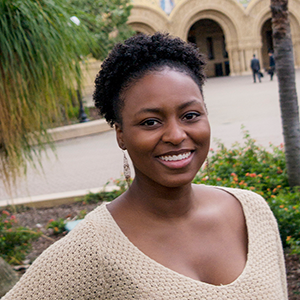

# Team Name

## Team Members

| Member | Photograph |
|:---:| --- |
| Ashi |  |
| Dylan |  |
| Isi |  |
| Shelby |  |
| Zoe | --- |

| Ashi | Dylan | Isi | Shelby | Zoe |
| --- | --- | --- | --- | --- |
|  |  |  |  | --- |

## Team Skills Matrix

| Member | Skills | Personal Traits | Desired Growth | Weaknesses |
|:---:| --- | --- | --- | --- |
| Ashi | --- | --- | --- | --- |
| Dylan | --- | --- | --- | --- |
| Isi | AI/ML, Data Science, Python, Illustrator/Photoshop | Hard-working, cooperative, easy-going | Building a full system from scratch, web development | Front end, web/app development, clearly elaborating thoughts |
| Shelby | --- | --- | --- | --- |
| Zoe | --- | --- | --- | --- |

## Team Communication

1. Text

2. Email

| Name | Email |
|:---:|:---:|
| Ashi | ashia@stanford.edu |
| Dylan | dharding@stanford.edu |
| Isi | iokojie@stanford.edu |
| Shelby | shelbym@stanford.edu |
| Zoe | zpacalin@stanford.edu |

## SGM Form

[Google Form](https://goo.gl/forms/ZzoZQtrTO1qZPxPJ2)
