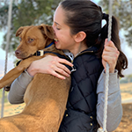

# Team Name

## Team Members

| Ashi | Dylan | Isi | Shelby | Zoe |
| --- | --- | --- | --- | --- |
|  |  |  |  |  |

## Team Skills Matrix

| Member | Skills | Personal Traits | Desired Growth | Weaknesses |
|:---:| --- | --- | --- | --- |
| Ashi | Python, WebDev, Testing | Extroverted, optimistic, hard-working | AI/ML, rapid prototyping | Consistency in work sessions, sleep |
| Dylan | UX/UI, Design, Needfinding | Open-minded, cooperative, motivated | Front end, mobile/web development | Confidence, experience building full product |
| Isi | AI/ML, Data Science, Python, Illustrator/Photoshop | Hard-working, cooperative, easy-going | Building a full system from scratch, web development | Front end, web/app development, clearly elaborating thoughts |
| Shelby | AI/ML, Data Science, Python, Illustrator/Photoshop | dog person | Web development | dog person |
| Zoe | Databases, Java, Object oriented design, some ML | Organized, collaborative, initiative-taking, hard-working | front end/ scripting, ios, more AI | Confidence, music knowledge (relevant if we go that direction) |

## Team Communication

1. Slack

2. Email

| Name | Email |
|:---:|:---:|
| Ashi | ashia@stanford.edu |
| Dylan | dharding@stanford.edu |
| Isi | iokojie@stanford.edu |
| Shelby | shelbym@stanford.edu |
| Zoe | zpacalin@stanford.edu |

## SGM Form

[Google Form](https://goo.gl/forms/ZzoZQtrTO1qZPxPJ2)
